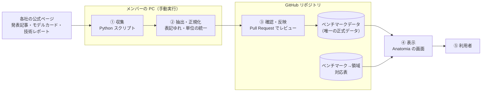

# Anatomia 企画書

> **位置づけ**：Anatomia が「誰の、どんな課題を、どう解くのか」に答える企画書\
> **確度**：**ドラフト（チームレビュー後・リーダー承認前）**\
> **R-1・R-2 の反映先**：§2-4・§3-3・§6-3・§8。§2-2 の理由 2 と §4-3 は、成功の定義の見直しとして別の PR で反映する\
> **更新のしかた**：上書き（最新が正）\
> **最終更新**：2026-10-02（R-1・R-2 の結果を反映）

> [!NOTE]
> **本文中の記号**
>
> - **【案】**：提案の段階で、チームでは未合意
> - **【未決】**：先生またはチームへの確認が必要な事項。§8 にまとめてある

---

## 0. 概要

| 項目 | 内容 |
| --- | --- |
| プロジェクト名 | Anatomia（アナトミア） — AIモデル分析ツール |
| 一言でいうと | 各AI企業が公表するモデルのベンチマークを集め、「どのモデルが、どの領域で強いか・弱いか」を1画面で比較できるWebツール |
| 位置づけ | 学校の授業の一環として行うプロジェクト |
| チーム | Cheers（§7） |

---

## 1. 背景

### 1-1. モデルを選ぶことが、利用者の仕事になった

- OpenAI（GPT）、Anthropic（Claude）、Google（Gemini）などが次々にモデルを公開している
- 利用者はモデルを直接ではなく、AIエージェント（コーディングエージェント、チャットアシスタントなど）経由で使うことが多い。多くのエージェントツールはモデルを切り替えられるため、**「どのモデルを使うか」の判断が利用者に委ねられている**

### 1-2. 判断材料はあるが、比較できる形になっていない

モデルの性能を示すベンチマークは各社から公表されている。しかし、利用者がそれを判断に使うまでには次の壁がある。

| 課題 | 具体的に起きていること |
| --- | --- |
| **散在している** | ベンチマークは各社の発表記事・モデルカード・技術レポートにばらばらに載っている。比較するには各社のサイトを巡回する必要がある |
| **揃っていない** | 各社で公表するベンチマークの種類・表記・測定条件（試行回数、ツール使用の有無、推論モードなど）が異なり、数値をそのまま並べられない |
| **何の能力か分かりにくい** | 「SWE-bench」「GPQA」などのベンチマーク名から、何の能力（コーディング、科学的推論など）を測っているかを読み取るには前提知識が要る |
| **すぐ古くなる** | 新モデルの公開サイクルが短く、調べた結果がすぐ古くなる。いつ時点の情報なのかも分かりにくい |

その結果、「結局どのモデルがどの領域で有用なのか」を知るのに手間がかかり、利用者は評判や慣れでモデルを選びがちになる（**仮説**。§5 の R-8 で検証する）。

### 1-3. 想定利用者

| 項目 | 内容 |
| --- | --- |
| 誰が | AIエージェントを使って開発や学習を行う人（まずは同じ学校の学生・エンジニア志望者を想定） |
| いつ使うか | 新しいモデルが公開されたとき／取り組むタスクに合ったモデルを選びたいとき |

---

## 2. テーマ決定

### 2-1. テーマ

> **AIモデルを領域ごとに「解剖」し、強みと弱みを1画面で見せる**

Anatomia はラテン語などで「解剖（学）」を意味する。モデルを一つの総合点で語るのではなく、領域ごとに分解して見せるというコンセプトを表す。

### 2-2. このテーマを選んだ理由

1. **課題が身近で、検証できる** — 私たち自身や同級生がAIエージェントを日常的に使っており、想定利用者に直接ヒアリングして課題を確かめられる
2. **授業の制約と解き方が噛み合う** — 必要なデータは各社が公表しており、Pythonスクリプトで集める対象になる。ただし、スクリプトで取れるかは取得元で変わる。自社サイトのまま、先生の確認なしで取れるのは Google だけで、他社は規約や公開形式（画像・ボット対策）に壁がある（[R-2 §1](research/r2-terms-robots.md)、[R-1 §3](research/r1-benchmark-formats.md)）。そこで、**どこから取るか（公式組織の Hugging Face の README など）の選び方が実現性を左右する**ものとして、取得元ごとに対象を決める（§5 R-3。取得元ごとの見通しは §4-3 の「社数の見通し」）。さらに、メンバーが手動で実行するという制約は、**取得した値を人が確認してから反映する工程**としてそのまま品質管理に使える
3. **小さく始めて広げられる** — 対象企業・ベンチマークを絞った最小構成から始め、企業・ベンチマーク・機能を段階的に増やせる

### 2-3. スコープ

#### やること（段階的に進める）

| 段階 | やること | 位置づけ |
| --- | --- | --- |
| **第1段階** | 各社が公式に公表したベンチマークスコアの収集（Pythonスクリプト・手動実行） | 必須。背景の課題に直接答える |
| **第1段階** | ベンチマークと領域（コーディング、数学など）の対応づけ | 必須 |
| **第1段階** | モデル×領域で強み・弱みを見られる一覧画面 | 必須 |
| **第1段階** | 全スコアへの出典URL・取得日・測定条件の表示 | 必須。信頼性の前提（§4-4） |
| 第2段階 | 価格（API料金）の収集と、コストパフォーマンスの表示 | README に記載。定義を R-6 で調査してから着手【案】 |
| 将来 | 用途に応じた最適なモデルのレコメンド | README に記載。第1・第2段階のデータが揃ってから検討 |

> **第2段階を後に回す理由【案】**：背景の課題（どの領域で強いか）に直接答えるのはベンチマークで、価格は比較の補助にあたる。また、公表されている価格は API の従量料金（トークン単価）が中心で、エージェント利用者の多くが払う月額料金とは単位が異なる。「コストパフォーマンス」を何で測るかを先に決めないと、誤解を招く表示になるおそれがある。

#### やらないこと

| やらないこと | 理由 |
| --- | --- |
| 自前でベンチマークを実行する | 計算資源・API費用がかかり、授業の範囲を超える。Anatomia の価値は「公表値の集約と整理」に置く |
| 定期的な自動クロール | 授業の制約（手動スクレイピング）。相手サイトへの負荷を最小限にする意味もある |
| 単一の総合スコアによる順位づけ | 測定条件の揃っていない数値を合算すると、実態と異なる優劣を示すおそれがある |
| 第三者機関のリーダーボードの値の取り込み | 対象を「各社が公表した値」に絞る。出典の性質が混ざると、比較の前提が崩れる |
| モデルを実際に使う機能（チャットなど） | 目的は比較・選定の支援で、利用は各社のツールで行う |

> **第三者機関のリーダーボードの位置づけ【案】**：値は取り込まないが、R-7 の調査や、公表値を確かめる参考として見るのはよい。食い違いに気づいたら出典ページを確認し直し、第三者の値で正式データを直したり、画面に並べたりはしない。

### 2-4. 「強い・弱い」の定義 — このツールの設計原則

各社は、自社モデルが良い結果を出したベンチマークを選んで公表する傾向がある。つまり**公表値だけでは「弱い領域」は直接には見えない**。そこで、次の4つを設計原則とする。

1. **「強い・弱い」は、同じベンチマークを公表したモデル同士の相対比較で示す**
2. **「未公表」と「低スコア」を区別して表示する。** 未公表を「弱い」とは扱わない
3. **測定条件が異なる値は、条件を明示して並べる。** 比較してよいかを利用者が判断できるようにする
4. **取り込むのは、各社が自社モデルについて公表した値だけ。** 置き場所（自社サイト・公式組織の Hugging Face）は問わない（[R-1 §4-1・§4-6](research/r1-benchmark-formats.md)）
    - Hugging Face の値は、公式組織の README.md に書かれた表から取る。Hub が表示する「Evaluation results」には第三者の PR で提案された値（`verified: false`）が混ざるので、使わない
    - 同じ会社の別モデルの値は取り込んでよい。他社モデルの値（比較表に並ぶ他社の列）は、取り込まない

---

## 3. ツールを実現するためのフロー

### 3-1. 全体像

### 3-2. 各工程

| # | 工程 | 内容 | 担い手 | 成果物 |
| --- | --- | --- | --- | --- |
| ① | 収集 | 各社の公式ページを Python スクリプトで取得する。**メンバーが手動で実行する** | メンバー | 取得したページ（確認用として実行者の手元にのみ保存） |
| ② | 抽出・正規化 | 取得したページからスコアを抽出し、ベンチマーク名の表記ゆれ（例：「SWE-bench Verified」と「SWE-Bench (Verified)」）や単位を統一する | Python スクリプト | 正式データへの更新差分 |
| ③ | 確認・反映 | 差分を**実行者以外のメンバー**が出典ページと照合し、一致を確かめてから正式データに反映する | メンバー | ベンチマークデータ（正式） |
| ④ | 表示 | 正式データと対応表から画面を生成する | Webアプリ | Anatomia の画面 |
| ⑤ | 利用 | 領域ごとの強み・弱みを見て、出典へ遡って確認する | 利用者 | — |

> **③で人の確認を挟む理由**：スクレイピングは、相手のページ構造が変わると誤った値を取り得る。手動実行の制約を活かし、**誤った値が画面に出る前に止める**。

### 3-3. データの持ち方

- **正式データはリポジトリ内の1箇所にだけ置く【案】。** 画面は正式データから生成し、画面側ではデータを持たない（同じデータを2箇所で管理すると、食い違いが起きたときにどちらが正しいか分からなくなるため）
- ベンチマーク→領域の対応表も同じ場所に置く。「このベンチマークをなぜこの領域に分類したか」の判断を1箇所で追えるようにする
- Git の履歴が、そのまま「いつ・誰が・何を更新したか」の記録になる

1件のスコアが持つ情報【案】：

| 項目 | 例 | なぜ必要か |
| --- | --- | --- |
| モデル名・提供企業 | （各社のモデル名） | 比較の単位 |
| 種類・推論モード | Reasoning／Instruct／Base、Non-Think／High／Max | 同じモデル名でも、種類・推論モードが違う値は、「モデル名＋種類＋推論モード」の組で区別して持つ。取得元の表の行の名前（例：Ministral 3 14B）だけで取ると、種類の違う値が1つにまとまる（[R-1 §4-7](research/r1-benchmark-formats.md)）。モデルを何個と数えるかは、これとは別に §4-3 で決める |
| ベンチマーク名 | SWE-bench Verified | 正規化後の名称で持つ。正規化で揃えるのは書き方（大文字小文字・ハイフン・空白・括弧の付け方・略記・提供元の名前）だけ（[R-1 §4-2](research/r1-benchmark-formats.md)の一覧に、括弧の付け方を加えた） |
| ベンチマークの版・種類 | 2.1／4.0、v2、Verified／Pro | 版や種類が違えば別のベンチマーク。同じモデルでも値が大きく違うので、名前を揃えて同じ列に並べない。名前に含めるか別の項目にするかは、R-4・R-5 で決める |
| スコア・単位 | 72.5（%） | 単位が混在する（小数・%・Elo）ので、単位を値と一緒に持つ（[R-1 §4-7](research/r1-benchmark-formats.md)） |
| 測定条件 | 1回の試行、ツール使用あり、Pass@1、ハーネス | 条件が異なる値を区別する（§2-4 原則3）。括弧内の指標やハーネスは、名前ではなくここに記録する |
| 出典URL | 各社のモデルカード・発表記事のURL | 利用者が一次情報へ遡れるようにする。実際に取ったページを書く |
| 取得日・取得者 | 2026-10-01・水戸 | 手動実行のため、いつ誰が取得した値かを追えるようにする |
| 取得方法 | スクリプト／手入力 | 手入力した値は、スクリプトでは取り直せない。再収集のときに区別する（§8 Q-1） |
| README の版（`sha`） | Hugging Face のリポジトリの `sha` | README は後から編集される。③の確認で、どの版の値かを特定できるようにする（Hugging Face から取った値のみ。[R-1 §4-1](research/r1-benchmark-formats.md)） |

### 3-4. 画面イメージ【案】

モデルを行、領域を列にした一覧表を中心に置く。

| モデル | コーディング | 数学 | 科学的推論 | エージェント | … |
| --- | --- | --- | --- | --- | --- |
| モデルA | **強** | 中 | 未公表 | 強 | |
| モデルB | 弱 | **強** | 中 | 未公表 | |

- 企業・領域で絞り込める
- セルを選ぶと、その領域に含まれるベンチマーク別のスコア・測定条件・出典URLが表示される
- 公表値がない場合は、空欄にせず「未公表」と表示する（§2-4 原則2）
- 画面上に、データの最終取得日を常に表示する
- 領域単位の「強・中・弱」の算出方法は【未決】（R-5 の結果で決める。§8 Q-6）

---

## 4. 有効性

### 4-1. 現状との比較

| 観点 | 現状（各社サイトを巡回） | Anatomia |
| --- | --- | --- |
| 情報を集める手間 | 企業ごとに発表記事・モデルカードを探して読む | 1画面で一覧できる |
| 比較のしやすさ | ベンチマークの種類・表記・条件が揃っていない | 表記を統一し、測定条件を並べて表示する |
| 何の能力かの理解 | ベンチマーク名から自分で調べる | 領域（コーディング、数学など）で整理されている |
| 情報の鮮度・信頼性 | いつ時点の情報か分かりにくい | 全スコアに取得日と出典URLがあり、一次情報へ1クリックで遡れる |

### 4-2. 既存サービスとの違い

モデルを比較するサービスは既に存在する（例：独自に測定した性能・価格・速度を比較する Artificial Analysis、人による対戦形式の投票でモデルを評価する LMArena）。詳細は R-7 で調査する。

Anatomia の立ち位置【案】：

- **各社の公式公表値（一次情報）に絞り**、すべての値を出典へ遡れるようにする
- 総合順位ではなく、**領域ごとの強み・弱み**を見せる
- 日本語で閲覧できる

> R-7 の結果、既存サービスとの差が小さいと分かった場合は、差別化の軸を見直す。

### 4-3. 成功の定義（第1段階）【案】

| 指標 | 目標 | 測り方・根拠 |
| --- | --- | --- |
| 対象企業数 | 5社以上（暫定。下の「社数の見通し」を参照） | 主要なモデル提供企業を一通り含み、比較として意味を持つ最低ライン。数え方は、**スクリプトで取得した企業**と、**手入力を含めた企業**を分けて書く。目標をどちらの数に当てるかは、見直し（下記）で決める |
| 対象企業の顔ぶれ | R-8 で利用者が使っていると答えた企業を、何割含むか（暫定。割合は R-8 の結果が出てから決める） | 社数だけでは、どの企業が入っていれば比較として意味を持つかが決まらない。利用者が実際に使う企業を含むことを基準にする。R-8 のヒアリング・アンケートで、使っているモデルの提供企業を聞く |
| 対象モデル数 | 15モデル以上（暫定。下の「モデルの数え方」を参照） | 各社の現行主力モデル。「1社あたり2〜3モデル × 5社程度」だと 10〜15 モデルになり、15 以上にするには、5 社なら各社 3 モデルずつ要る。目標の数値と、スクリプトで取得したモデルの数・手入力を含めたモデルの数のどちらに当てるかは、見直し（下記）で決める |
| 出典の付与率 | 全スコアの100% | 公表値の集約が価値の中心であり、出典の分からない値が1件でもあると信頼性が崩れる |
| 比較にかかる時間 | 各社サイト巡回の半分以下 | ユーザーテスト。同じ課題（例：「数学が最も得意なモデルを、根拠つきで答える」）を、各社サイト巡回と Anatomia でそれぞれ解いてもらい時間を比べる |
| 分かりやすさ | 5段階評価で平均4以上 | ユーザーテスト後のアンケート |

#### 社数の見通し（R-2 §1 の整理。R-3 で確定する）

スクリプトでの取得だけで 5 社に届くかは、先生の回答で決まる。

| 場合 | 取れる企業 | 社数 |
| --- | --- | --- |
| 先生の確認なし | Google | 1 |
| Q-8（Hugging Face の整理）が認められた | ＋ DeepSeek・Qwen | 3 |
| さらに Q-9（消費者向け規約）が「適用されない」（または「`Allow` を許可とみなせる」。根拠は弱い） | ＋ Anthropic・xAI | 5 |
| Q-1 で手入力が認められた（Q-8・Q-9 の答えによらない） | ＋ スクリプトで取れない企業を手入力で補う（Q-8・Q-9 が認められた場合は、Meta、OpenAI、Mistral の主力モデルなど） | 最大 8 |

- Mistral の Ministral 3 系はスクリプトで取れるが小型モデルだけなので、社数に数えるかは R-3 で判断する（Q-8 が認められれば 4 社目になりうる）
- Q-9（質問 B）の前半が「及ばない」となった場合は、Meta も再検討する（R-2 §4）
- **最悪の場合（Q-8・Q-9 とも認められず、手入力も不可）は 1 社**になる。その場合は、成功の定義そのものを見直す

#### モデルの数え方

- **数える単位は「モデル名」にする。** 同じモデルの種類・推論モードの違い（DeepSeek-V4-Pro の Non-Think／High／Max、Ministral 3 14B の Reasoning／Instruct／Base）は、1 モデルと数える。「モデル名＋種類＋推論モード」の組（§3-3）で数えると、1 つのモデルが何件にも増え、15 は簡単に満たせてしまうため
- **「主力モデル」の基準【案】**：各社が現行の主力として発表している、最新世代のモデル。**この文書には基準だけを書き、具体的なモデルは R-3 で決める**。R-3 では、次の 3 点も判断する（判断するのは、リーダー）
  - 世代の区切り（同じ系列の新旧のモデルが並ぶとき、どこまでを最新世代とみるか。例は [R-1 §2](research/r1-benchmark-formats.md) の「最新の主力モデル」の列）
  - サイズ違い（例：R-1 §2 の Ministral 3 系の 3B・8B・14B）を、別のモデルと数えるか
  - 小型モデルだけの系列（Ministral 3 系など）を含めるか

#### 見直し

- 数値目標（企業数・モデル数・顔ぶれの割合）は、**R-3 の完了時に 1 回**見直す。その時点で R-8 の結果が出ていなければ、顔ぶれの割合は **R-8 の完了時に**決める（決めるのはリーダー）
- 比較にかかる時間・分かりやすさの目標は、集められる人数やテストの設計で現実的な値が変わるので、**ユーザーテストの設計を固めるときに**見直す
- 出典の付与率（全スコアの100%）は、信頼性の前提なので、見直しの対象にしない
- **見直しを決めるのは、リーダー**とする。Q-1・Q-8・Q-9 の先生の回答が出ていない場合は、場合分け（上の表）のまま見直す

### 4-4. 有効性の限界

以下は隠さずに画面上で示すことを、Anatomia の信頼性の前提とする。

- 公表値は各社の自己申告であり、第三者が検証した値ではない
- 各社は得意なベンチマークを選んで公表する傾向があり、弱みは「未公表」として現れやすい（§2-4）
- 手動更新のため、最新モデルの反映に遅れが出る

---

## 5. 調査項目

**優先度「高」は、結果次第で実現可能性や方針そのものが変わる項目。** 最初に着手する。

| ID | 調査項目 | 何のために調べるか | 調査方法 | 優先度 |
| --- | --- | --- | --- | --- |
| R-1 | 各社のベンチマークの公開形式（HTMLの表／画像／PDF／Markdown） | スクレイピングで取得できるかを判断する。**画像で公開された値はスクリプトで抽出できない**ため、対象企業の選定に直結する | 対象候補の公式ページを実際に確認し、形式を一覧にする | 高 |
| R-2 | 各社サイトの利用規約・robots.txt | スクレイピングが許容されているかを確認する。禁止されているサイトは対象から外す | 各社の利用規約・robots.txt を読む。判断に迷うものは先生に相談する | 高 |
| R-3 | 対象企業・モデルの選定 | 成功の定義（§4-3）を満たす対象を決める | R-1・R-2 の結果から取得可能な企業を選ぶ（候補：OpenAI、Anthropic、Google、Meta、xAI、Mistral AI、DeepSeek、Alibaba（Qwen）など） | 高 |
| R-4 | 主要ベンチマークの内容と領域の対応 | ベンチマークを領域に正しく分類する（対応表の根拠になる） | 各ベンチマークの論文・公式サイトで「何を測っているか」を確認する（候補：SWE-bench Verified、AIME、GPQA Diamond、MMMU、Humanity's Last Exam、τ²-bench など） | 中 |
| R-5 | 測定条件の違いと比較可能性 | 条件が異なる値の並べ方と、領域単位の「強・中・弱」の算出方法を決める | R-1 で集めたページの脚注・注記を比較する | 中 |
| R-6 | 価格情報の公開形式と「コストパフォーマンス」の定義 | 第2段階の設計に使う。何を「コスト」とするか（API料金か月額料金か）を決める | 各社の料金ページを確認する | 低 |
| R-7 | 既存サービス | Anatomia の差別化を確かめる | Artificial Analysis、LMArena など既存の比較サービスを実際に使って比べる | 中 |
| R-8 | 想定利用者のニーズ | 背景の仮説（「比較に手間がかかっている」「評判や慣れで選んでいる」）を確かめる | 同級生など AIエージェント利用者へのヒアリング・アンケート（5人以上【案】） | 中 |
| R-9 | 収集・表示の技術 | 実装方式を確定する | requests／BeautifulSoup（HTML）、Playwright（JavaScriptで描画されるページ）、pdfplumber（PDF）の検証、画面で使う表・グラフのライブラリの比較 | 中（R-1 の後） |

---

## 6. 環境条件

### 6-1. 制約条件

| 制約 | 内容 |
| --- | --- |
| 授業 | 本プロジェクトは学校の授業の一環として行う |
| スクレイピング | **Pythonスクリプトで、メンバーが手動で実行する。** 定期実行・自動実行はしない |

### 6-2. 開発環境【案】

| 区分 | 内容 | 理由 |
| --- | --- | --- |
| 収集 | Python 3（バージョンはチームで固定）、requests、BeautifulSoup。必要に応じて Playwright、pdfplumber | 授業の制約。ライブラリは R-9 で確定する |
| データ | JSON または CSV ファイルをリポジトリで管理する | データ量は数百件程度の見込みで、データベースを立てる必要がない。Git の履歴が更新記録になる |
| 画面 | Next.js + TypeScript（静的サイトとして出力） | チームが別プロジェクト（YSE Compass）で使用しており、学習コストが低い。データは手動でしか更新されないため、サーバー処理のない静的サイトで足りる |
| バージョン管理 | Git／GitHub | Pull Request で③の確認を行い、更新履歴を残す |

> **収集と表示を分ける理由**：Python（収集）と Webアプリ（表示）は、**データファイルの形式だけを約束事としてやり取りする。** この約束事（JSON か CSV か、§3-3 の項目）は最初に固定し、収集と表示を並行して進められるようにする。どちらかを作り直しても、もう一方に影響しない。また、Webアプリからは一切スクレイピングしないので、手動実行の制約とも矛盾しない。
>
> **代替案**：Streamlit を使えば画面まで Python だけで作れる。学習コストはさらに下がるが、画面の自由度は下がる。どちらにするかは §8 Q-3。

### 6-3. スクレイピングの実行ルール【案】

| ルール | 理由 |
| --- | --- |
| robots.txt と利用規約で禁止されていない範囲でのみ取得する | R-2 の結果に従う。「許可されていない」ではなく「禁止されている」かで線を引く。法的な判断ではなく、規約の文面を読んだ整理（R-2 §6） |
| 「要相談」「不可」のサイト（R-2 §1。Hugging Face から取る企業の自社サイトも、自社規約が自動での取得や抽出を禁止しているので含める。R-2 §3-1）には、先生の回答が出るまで、調査や検証でもスクリプトでアクセスしない（規約ページはブラウザで確認する）。**ただし robots.txt の確認は除く**（取得の可否を確かめる標準の手順。間隔を空けて、1 回ずつ取る）。このルールは、§6-3 が【案】の間も、企画書（main）に入った時点から適用する（アクセスを控える側のルールのため） | 取得でなくても、規約が禁止する「スクリプトでのアクセス」にあたるおそれがあるため（R-2）。R-1・R-2 の調査は、このルールを企画書に入れる前に行った（R-1 は、要相談・不可のサイトのページも、JavaScript 実行前の生 HTML を 1 回ずつ取得して判定している。R-1 冒頭の調査方法） |
| リクエストの間隔を3秒以上空ける | 相手サーバーへの負荷を避けるため。相手がどれだけの負荷に耐えられるかは外から分からない。図書館サイトへの自動アクセスが業務妨害を疑われ、逮捕に至った事例（2010年・岡崎市立中央図書館事件。起訴猶予）では、アクセスは1秒に1回程度だった※ |
| 403・429、ボット判定の画面が返ったら、そのサイトでの取得を止める。制限を回避しない | 回避は、相手の意思に反するアクセスになるため（OpenAI がこの例。[R-1 §3](research/r1-benchmark-formats.md)） |
| Hugging Face からは、公式組織の README.md を `hf_hub_download` などで取得する（自社サイトからは取らない）。間隔のルールと、403・429・ボット判定で止めるルールも同じく適用する | 詳細は [R-2 §5](research/r2-terms-robots.md) |
| 取得するのは数値（スコア）と出典情報に限り、記事本文はリポジトリに含めず公開もしない | 他者の著作物の再配布を避けるため |
| 取得日・取得者をデータに記録する | 手動実行のため、いつ誰が取得した値かを追えるようにする |
| 取得結果は実行者以外のメンバーが確認してから反映する | ページ構造の変化で誤った値を取り得るため（§3-2 ③） |

※ 図書館側のソフトウェアに、1時間に400以上（平均9秒に1回にあたる）のリクエストを送られると他の処理ができなくなる不具合があったと報じられている（毎日jp 2010-08-22。以下の Wikipedia の記述による）。出典：[岡崎市立中央図書館事件（Wikipedia）](https://ja.wikipedia.org/wiki/%E5%B2%A1%E5%B4%8E%E5%B8%82%E7%AB%8B%E4%B8%AD%E5%A4%AE%E5%9B%B3%E6%9B%B8%E9%A4%A8%E4%BA%8B%E4%BB%B6)、[はてなニュース](https://hatenanews.com/articles/201009/1696)

### 6-4. 利用環境【案】

| 項目 | 内容 | 理由 |
| --- | --- | --- |
| 端末 | PC の Webブラウザ（Chrome・Edge などの最新版）を主な対象とする | モデル×領域の一覧表は横幅を必要とするため。スマートフォンは閲覧できる程度に留める |
| 公開範囲 | 【未決】学内限定か一般公開か | 一般公開する場合、各社の利用規約との関係（R-2）を踏まえた判断が要る |
| 更新頻度 | 週1回の確認＋新モデル公開時 | 手動実行の負担と情報の鮮度の釣り合いをとる |

---

## 7. チーム体制

チーム名：**Cheers**

| 役割 | 氏名 |
| --- | --- |
| リーダー | 蒲山 由梨花 |
| サブリーダー | 鈴木 和明 |
| メンバー | 水戸 匠 |

担当の割り振り（収集・画面・調査など）は【未決】（§8 Q-4）。

---

## 8. 未決事項

| ID | 事項 | 確認先 | 関連 |
| --- | --- | --- | --- |
| Q-1 | スクリプトで取得できない値の扱い（画像・PDFでしか公表されていない値や、ボット対策・規約のために自動では取得できないページの値。手入力を認めるか、対象外とするか） | 先生 | R-1、R-2、§6-1、Q-8、Q-9 |
| Q-2 | 公開範囲（学内限定か一般公開か） | 先生 | R-2、§6-4 |
| Q-3 | 技術スタックの確定（§6-2 の案か、Streamlit などの代替案か）。収集側のライブラリ（Playwright など）は R-9 で確定する | チーム（リーダー判断） | §6-2 |
| Q-4 | 担当の割り振り | チーム（リーダー判断） | §7 |
| Q-5 | スケジュール（授業の日程・発表日に合わせて作成する） | 先生・チーム | — |
| Q-6 | 領域単位の「強・中・弱」の算出方法 | チーム | §2-4、§3-4、R-5 |
| Q-7 | 第2段階（コストパフォーマンス）を授業期間内に含めるか | チーム（リーダー判断） | §2-3、R-6 |
| Q-8 | 【質問 A】Hugging Face の整理（DeepSeek・Qwen・Mistral） | 先生 | R-2 §4、§6-3 |
| Q-9 | 【質問 B】消費者向け規約の適用範囲（Anthropic・xAI） | 先生 | R-2 §4、§6-3 |

> **Q-8・Q-9 の文面は、R-2 §4 を正とする**（このファイルには ID・見出し（対象の企業）・確認先・関連だけを書く。文面が2か所に分かれて、聞き漏らすのを防ぐため）。
>
> **Q-1 の規模**：Q-8・Q-9 がどちらも認められなければ、Google 以外は手入力になる（企業ごとの場合分けは R-2 §1）。§6-1 の制約（Pythonスクリプトで、メンバーが手動で実行する）との関係も含めて、先生に確認する。

> **Q-1 で手入力を認める場合の条件【案】**：反映の前に、入力した人以外のメンバーが出典と照合する（§3-2 ③と同じ）。出典URL・取得日・取得者は、スクリプトで取得した値と同じく必須とし、手入力した値であること（「取得方法」の項目）もデータに記録する（§3-3）。
